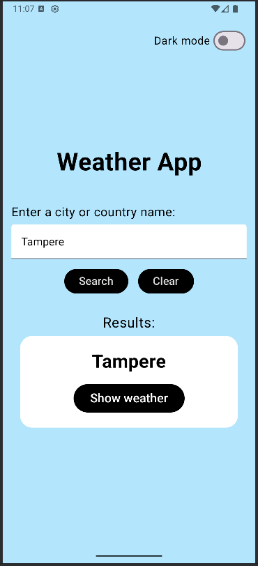
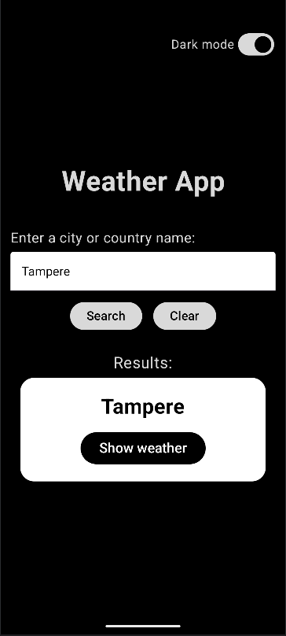
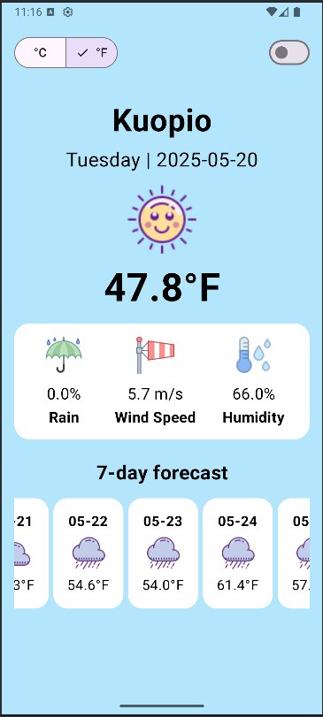
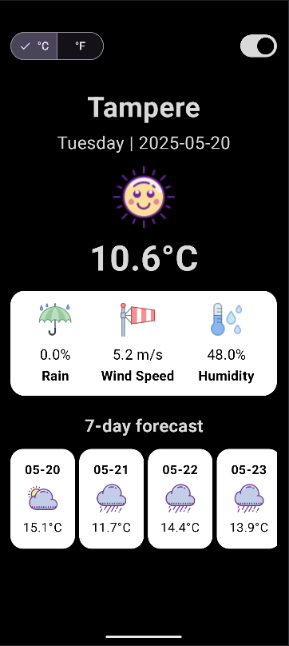
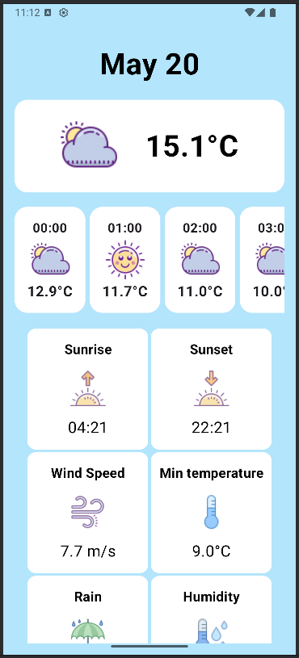
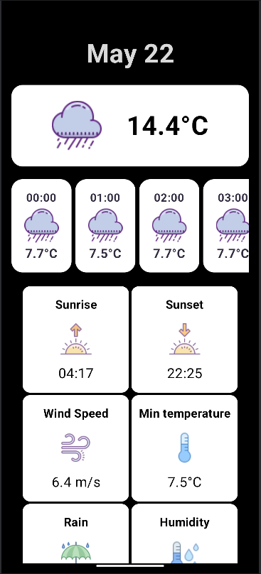

# 📦 MyWeatherApp

> An Android Weather App built with Jetpack Compose, showing current and forecasted weather data for a user-defined location.

---

## 🧠 Table of Contents

- [About](#about)
- [Optional Store Download Links](#optional-store-download-links)
- [Features](#features)
- [Screenshots](#screenshots)
- [Screencast](#screencast)
- [Getting Started](#getting-started)
- [Usage](#usage)
- [Configuration](#configuration)
- [Tech Stack](#tech-stack)
- [Testing](#testing)
- [Known Issues](#known-issues)
- [License](#license)
- [Contributing](#contributing)
- [Contact](#contact)

---

## 📖 About

MyWeatherApp is a weather application that retrieves real-time weather data using Open-Meteo's APIs and displays it in a clean UI.

- The app helps users check current and upcoming weather conditions by entering the location name.
- It supports both light and dark modes, as well as Celcius/Fahrenheit toggling.
- Uses both Open-Meteo Weather API and Open-Meteo Geocoding API to fetch accurate weather data based on user input.

---

## 📲 Optional Store Download Links

Currently not published to Google Play Store.

---

## ✨ Features

- ✅ Search weather by entering a city or country name.
- ✅ Display current weather and 7-day forecast
- ✅ Switch between light and dark themes
- ✅ Toggle between Celsius and Fahrenheit

---

## 📸 Screenshots








---

## 🎦 Screencast

Link to the screencast: https://tuni-my.sharepoint.com/:v:/g/personal/viivi_p_siren_tuni_fi/EeppExWjzmFIq0TnCyzXFbEBhqJzIVk0Kl4c1wEQVIeSyw

---

## 🚀 Getting Started

### Prerequisites

- Android Studio Meerkat (2024.3.1 Patch 1) or newer
- Android SDK 35
- Kotlin 2.0.21
- Gradle Plugin 8.9.1
- Internet connection (for API requests)

### Installation

```bash
# Clone the repository
git clone https://github.com/viiviss/4A00EZ65-3005-mobile-development-siren-viivi.git

# Navigate into the project
cd 4A00EZ65-3005-mobile-development-siren-viivi/mob/project-work/MyWeatherApp

# Build and run on device or emulator in Android Studio
```
---

## ⚙️ Usage

How to run the app:

```bash
1. Open the project in Android Studio.
2. Select an emulator or connect an Android device.
3. Press "Run" (green triangle) to install and launch the app.
```

---

## 🛠 Configuration

List any configurable options or `.env` variables:

```env
- No .env file or API key required.
```

---

## 🧰 Tech Stack

- Language: Kotlin
- Framework: Jetpack Compose
- Tools: Retrofit, Gson, Material 3, Android ViewModel

---

## 🧪 Testing

No automated tests implemented. Manual testing was conducted on Android Emulator.

---

## 🐞 Known Issues

- Weather data cannot be refreshed without returning to the start screen
- Location validation may be inaccurate

---

## 📜 License

```
MIT License. See LICENSE file for details.
```
---
## Attributions

- Icons by <a target="_blank" href="https://icons8.com">Icons8</a>

---

## 🤝 Contributing

Pull requests are welcome. For major changes, open an issue first to discuss.

---

## 📫 Contact

Project maintained by [Viivi Siren](mailto:viivi.p.siren@tuni.fi).
